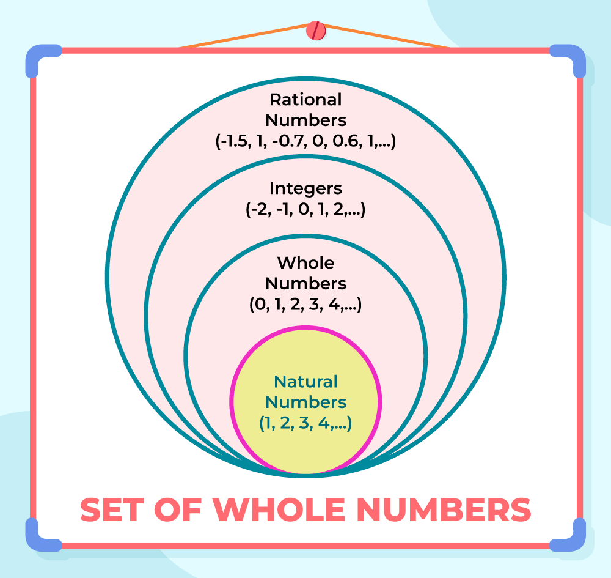

# kotlin-lotto

## 1단계 - 문자열 덧셈 계산기

- 쉼표(,) 또는 콜론(:)을 구분자로 가지는 문자열을 전달하는 경우 구분자를 기준으로 분리한 각 숫자의 합을 반환 (예: “” => 0, "1,2" => 3, "1,2,3" => 6, “1,2:3” => 6)
- 앞의 기본 구분자(쉼표, 콜론) 외에 커스텀 구분자를 지정할 수 있다. 커스텀 구분자는 문자열 앞부분의 “//”와 “\n” 사이에 위치하는 문자를 커스텀 구분자로 사용한다. 예를 들어 “//;\n1;2;3”과
  같이 값을 입력할 경우 커스텀 구분자는 세미콜론(;)이며, 결과 값은 6이 반환되어야 한다.
- 문자열 계산기에 숫자 이외의 값 또는 음수를 전달하는 경우 RuntimeException 예외를 throw 한다.

## 구현 목록

### StringDelimiterSeparator

- 커스텀 구분자를 찾는 클래스
- 커스텀 구분자가 존재하면 커스텀 구분자로 문자열 구분

### WholeNumber

- 문자열 또는 숫자의 0 과 양수를 나타내는 클래스

### StringAddCalculator

- 문자열을 덧셈하여 보여주는 유틸 클래스
- 비즈니스 로직을 구현하는 클래스

## 2단계 - 로또 (자동)

- 로또 구입 금액을 입력하면 구입 금액에 해당하는 로또를 발급해야 한다.
- 로또 1장의 가격은 1000원이다.

### Controller

#### LottoGame

- 로또 게임을 실행하는 클래스

### View

#### InputView

- 로또 구입 금액 입력

#### ResultView

- 구매 정보 출력
- 당첨 통계 출력

### Model

#### LottoStore

- 로또 금액만큼 생성

#### PurchasedLotto

- 구매한 로또 리스트 관리
- 구매된 금액 관리

#### LottoRank

- 일치하는 로또 번호 개수로 등수 계산

#### LottoNumber

- 1~45 까지의 로또 번호

#### LottoTicket

- 로또 번호 6개를 관리하는 티켓
- 일치하는 번호 갯수 계산

#### LottoScore

- 로또 등수 관리
- 수익률 계산

#### LottoTicketStorage

- 로또 티켓 제공

##### RandomLottoTicketStorage

- 랜덤 로또 티켓 제공