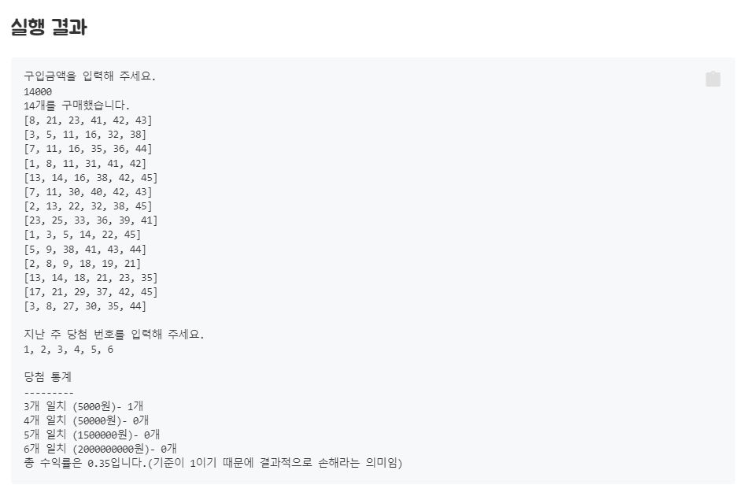

# kotlin-lotto
# 문자열 덧셈 계산기
## 기능 요구 사항
* 쉼표(,) 또는 콜론(:)을 구분자로 가지는 문자열을 전달하는 경우 구분자를 기준으로 분리한 각 숫자의 합을 반환 (예: “” => 0, "1,2" => 3, "1,2,3" => 6, “1,2:3” => 6)
* 앞의 기본 구분자(쉼표, 콜론) 외에 커스텀 구분자를 지정할 수 있다. 커스텀 구분자는 문자열 앞부분의 “//”와 “\n” 사이에 위치하는 문자를 커스텀 구분자로 사용한다. 예를 들어 “//;\n1;2;3”과 같이 값을 입력할 경우 커스텀 구분자는 세미콜론(;)이며, 결과 값은 6이 반환되어야 한다.
* 문자열 계산기에 숫자 이외의 값 또는 음수를 전달하는 경우 RuntimeException 예외를 throw 한다.
## 프로그래밍 요구 사항
* indent(인덴트, 들여쓰기) depth를 2를 넘지 않도록 구현한다. 1까지만 허용한다.
* 예를 들어 while문 안에 if문이 있으면 들여쓰기는 2이다.
* 힌트: indent(인덴트, 들여쓰기) depth를 줄이는 좋은 방법은 함수(또는 메서드)를 분리하면 된다.
* 함수(또는 메서드)의 길이가 10라인을 넘어가지 않도록 구현한다.
* 함수(또는 메서드)가 한 가지 일만 잘 하도록 구현한다.

## 요구사항 정리
크게 구분자를 구분하는 것, 구분자 기준으로 문자열에서 숫자를 나눠서 추출하는 것, 추출한 숫자를 합산하는 것으로 요약할 수 있다.

### 구분자 
입력받는 문자열에서 커스텀 구분자와 기본 구분자를 나눌 수 있다.
* 구분자의 종류
  * 기본 구분자
    * 쉼표, 콜론.
  * 커스텀 구분자
    * //”와 “\n” 사이에 위치하는 문자.
    * 커스텀 패턴을 인지하고 나면 문자열 수식의 시작점을 다시 잡아야 한다.-> //특수문자\n 이후부터를 수식의 시작으로 잡아야 하기 때문
  * 기본, 커스텀 둘다 혼용이 가능한 상황을 상정하자.
  * 문자열에서 커스텀 구분자의 유무를 찾자.
  * 문자열에서 기본 구분자의 유무를 찾자.
  * 예외사항
    * 특수문자가 커스텀을 사용하는 것 제외하고 문자열에 들어갈 수 있는지 확인이 필요하다. ex)1,2:3 을 주입받앗을때 ':'는 커스텀도, 기본도 아닌 예외 문자인데, 이러한 경우가 있는지 알아야 한다.-> 우선 없다고 상정하고 진행.
* 구분자 기준으로 문자열 나누기
  * split에 delim을 파라메터로 받아서 여러가지 케이스를 다룰 수 있게 하자.
    * 특수문자 기준으로 숫자들을 잘라서 하나의 list로 생성해서 반환하는 것을 목적으로 만든다.
### 더하기
위에서 특수문자 기준으로 추출한 숫자들의 list를 순차적으로 꺼내서 합산한다. ->숫자들의 합은 숫자일급콜랙션의 책임으로 만들어보자.
* 테스트케이스를 용이하게 만드는 구조로 고민을 해야 한다.
  * 문자열을 자르는 행위를 분리하고 숫자리스트를 제공받았을 때의 값을 꺼내고 더하는 역할만을 다루도록 책임을 분리하자.

## 요구사항 기준 책임을 나눠보자.
* StringCalculator 클래스
  * 문자열을 특정 키워드 기준으로 자른다.
  * 문자열에서 커스텀 구분자를 찾는다.
    * 있으면 해당 구분자로 문자열을 나눈다.
  * 문자열에서 기본 구분자를 찾는다.
    * 있으면 해당 구분자로 문자열을 나눈다.
* Number 클래스
  * 원시값 포장 클래스. 
  * 문자열 -> 숫자로 형변한하는 영역의 책임을 다룬다.
    * 숫자가 아닌 다른 문자열을 받았을 경우, 에러를 반환한다.
    * 음수인 숫자를 받았을 경우, 에러를 반환한다.
* Numbers 클래스
  * Number의 일급 콜랙션.
  * Number의 원시값들을 List<Int> 형식의 콜랙션을 반환한다.
  * 주입받은 숫자 콜랙션을 순차적으로 꺼내서 더한다.
    * 더한 결과를 반환한다.

# 로또(자동)
## 기능 요구사항
* 로또 구입 금액을 입력하면 구입 금액에 해당하는 로또를 발급해야 한다.
* 로또 1장의 가격은 1000원이다.
 

## 프로그래밍 요구 사항
* 모든 기능을 TDD로 구현해 단위 테스트가 존재해야 한다. 단, UI(System.out, System.in) 로직은 제외
* 핵심 로직을 구현하는 코드와 UI를 담당하는 로직을 구분한다.
* UI 로직을 InputView, ResultView와 같은 클래스를 추가해 분리한다.
  * indent(인덴트, 들여쓰기) depth를 2를 넘지 않도록 구현한다. 1까지만 허용한다.
  * 예를 들어 while문 안에 if문이 있으면 들여쓰기는 2이다.
    * 힌트: indent(인덴트, 들여쓰기) depth를 줄이는 좋은 방법은 함수(또는 메서드)를 분리하면 된다.
* 함수(또는 메서드)의 길이가 15라인을 넘어가지 않도록 구현한다.
* 함수(또는 메서드)가 한 가지 일만 잘 하도록 구현한다.
* 기능을 구현하기 전에 README.md 파일에 구현할 기능 목록을 정리해 추가한다.
* git의 commit 단위는 앞 단계에서 README.md 파일에 정리한 기능 목록 단위로 추가한다.

## 요구사항 정리
생각나는 구성요소로는 다음과 같이 생각된다.
* 구입금액
* 구매장수
* 로또들(로또의 일급콜랙션)
* 로또
* 번호
* 6개의 중복 없는 수로 구성된 구매 로또
* 1~45의 번호 풀
* 구매방식(자동)
* 6개의 중복 없는 수로 구성된 당첨 번호
* 문자열로 번호 6개 입력과 쉼표로 구분
* 맞춘 로또의 번호 갯수
* 맞춘 로또의 번호에 해당하는 당첨금
* 총수익률

## 요구사항 기준 책임을 나눠보자.
* Purchase class
  * 구입금액을 받아 구매수량을 반환하는 책임.
  * 입금되는 금액에 대한 검증
    * 0이하의 금액이면 에러를 반환.
    * 1000원단위의 금액이 아닌경우 에러를 반환.
* LottoNumber class
  * 1~45의 숫자 객체를 미리 생성하고 주입받은 숫자에 해당하는 LottoNumber 객체를 정적팩토리 메소드를 통해서 반환하자.
    * 미리 생성해둔 객체를 숫자값에 따라 반복 지급이 가능하고 동일성을 보장할 수 있다.
  * 생성자에 Int 타입 숫자를 사용.
  * 번호의 범위가 1~45 사이 인지를 검증 한다.
  * 요청받는 숫자와 클래스가 가진 숫자와 일치하는지 여부를 반환하는 책임.
    * 객체를 정적팩토리 메소드로 생성하여 동일성 보장을 할 수 있다면 객체 비교로 확인이 가능할 것이다.
* Lotto class
  * 6개의 LottoNumber 로 구성.-> 콜랙션 길이 제한을 고려하자.(6자리의 배열로 생성하는 것을 고려해볼 만하다.)
    * 스스로 번호 6개를 생성하는 책임.
  * 생성시 같은 번호의 Number 객체가 있는지를 검증한다.(중복 회피)
  * 당첨 번호 6개와 비교하여 일치 하는지 검증한다.
    * 각 LottoNumber 에게 자릿수별 번호의 일치여부 메세지를 주고 받는다.
    * 일치하는 번호의 갯수를 반환하는 책임.
  * 오름차순으로 LottoNumber가 생성되어야 하므로 순서가 있는 콜랙션을 사용하자.
* LottoBundle class
  * 입력된 금액을 1000으로 나눈 수 만큼 생성된 Lotto의 일급콜랙션.
    * Lotto class를 생성하는 책임.
  * 당첨 번호6개를 전달 받아 각 Lotto 별로 당첨된 번호 갯수를 반환 받는 책임.
    * 번호생성을 할때 전략패턴을 주입받아 생성.
* NumberCreateStrategy interface
  * 번호생성방식 따른 6개의 번호 생성 방식을 다룬다.
  * AutoNumberCreateStrategy
    * 자동방식에 따라 생성수량을 주입받아 1개의 로또 마다 중복없는 랜덤한 번호 6개를 생성하여 반환.
* NumberGenerator object
  * 1~45의 Int 형 배열을 사용해서 6개의 중복없는 번호 묶음을 생성하여 반환한다.
    * 오름차순으로 정렬하여 생성.
* Rank enum
  * 번호 일치 갯수에 해당하는 상금을 가진다.
    * 4등 = 3개 : 5000
    * 3등 = 4개 : 50000
    * 2등 = 5개 : 1500000
    * 1등 = 6개 : 2000000000
    * 꽝 = 0~2개 : 0
  * Rank가 가진 상금구조에서 꽝을 제외한 나머지 등수들을 가지고 Record class를 생성한다.
* LotteryResult class
  * 당첨 통계에 대한 정보를 다룬다.
    * 당첨로또, 구매로또묶음, 등수정보를 주입받는다.
  * 일치하는 수에 맞는 당첨 정보를 생성한다.
    * Lottos에서 각 로또별 일치하는 번호 수
    * Prize의 각 상금정보별 해당하는 일치하는 갯수 정보를 만든다.
  * 총 수익율을 계산하는 책임.
    * 수식 : 당첨금액 / 구매비용
      * 소수 2째자리까지만 허용.
      * 버림 처리.