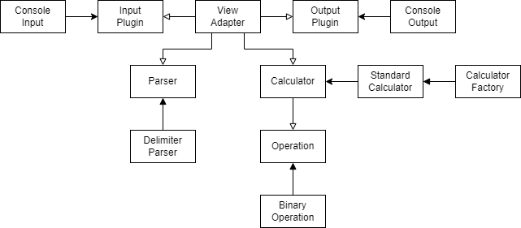

# 문자열 덧셈 계산기 설계 설명

## 구조
- 패키지 구조

### interface
- adapter
  - 값을 입력받아 애플리케이션을 실행
- input
  - 값을 입력받는 기능
- output
  - 결과를 출력하는 기능

### application
- parser
  - 입력된 문자열을 계산기 기능 구현을 위한 입력 모델로 변환
- calculator
    - 입력 받은 모델로 연산 수행

### domain
- operation
  - 연산 알고리즘을 담고있는 객체

### common
- 글로벌하게 사용되는 객체

### assemble
- 객체들의 각 의존성을 조합

## 테스트
- 유닛 테스트: StringSpec
- 통합 테스트(BDD Test): BehaviorSpec